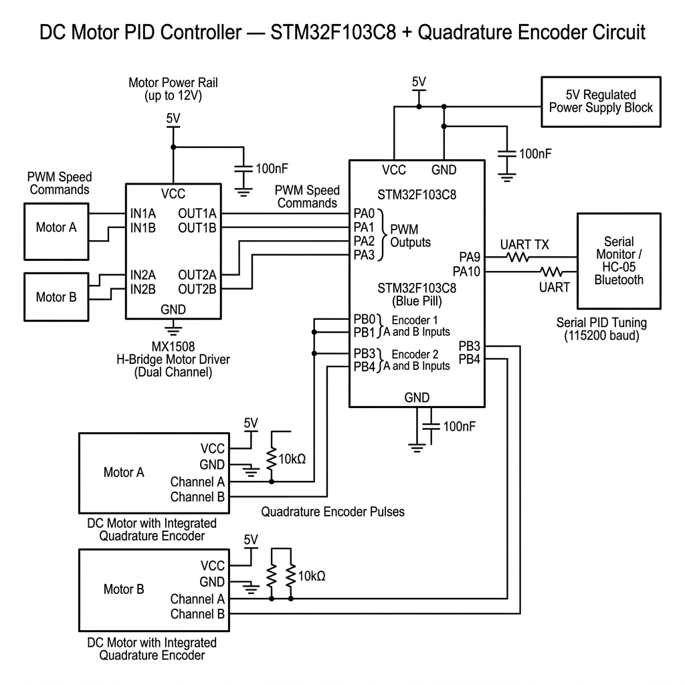

# DC Motor Controller with Quadrature Encoder and PID

Closed-loop position controller for two DC motors using an STM32F103C8 (Blue Pill). Quadrature encoder feedback is decoded via interrupt and a PID loop runs every 1ms using a hardware timer. Motor drive is through an MX1508 H-bridge.

Also includes an Arduino Uno single-motor speed controller in `firmware/arduino_reference/` that was used for initial testing.

---

## Performance

| Metric | Value |
|---|---|
| Step input (0 to 500 counts) settling time | ~118 ms |
| Steady-state position error | < 3 encoder counts |
| Overshoot | ~12% |
| Rise time (10% to 90%) | ~72 ms |
| Disturbance rejection | restores position in < 200 ms |
| PID sample period | 1 ms (Timer4 hardware interrupt) |

---

## Hardware

| Part | Detail |
|---|---|
| MCU | STM32F103C8T6, 72 MHz Cortex-M3 |
| H-bridge | MX1508 (dual channel, L298N compatible) |
| Motors | Mabutchi 5V DC motor with quadrature encoder |
| Serial | UART1 at 115200 baud (PA9/PA10) |

### Wiring

| Signal | Pin |
|---|---|
| Motor A forward PWM | PA0 |
| Motor A reverse PWM | PA1 |
| Motor B forward PWM | PA2 |
| Motor B reverse PWM | PA3 |
| Encoder A1 | PB0 |
| Encoder B1 | PB1 |
| Encoder A2 | PB3 |
| Encoder B2 | PB4 |
| UART TX | PA9 |
| UART RX | PA10 |
| LED | PC13 |

### Circuit



Proteus schematic: `schematics/motor_controller_schematic.pdsprj`

---

## Firmware

### stm32_motor_control/dc_motor_pid_stm32.ino

Main firmware. Quadrature decoding uses a 16-element lookup table inside the ISR (no branch instructions):
```c
int enc[] = {0,-1,1,0,1,0,0,-1,-1,0,0,1,0,1,-1,0};
```
4-bit index = {prev_B, prev_A, curr_B, curr_A}. Fast and deterministic.

PID runs in `tick()` which is called by Timer4 every 1ms:
```
Kp = 40   Ki = 10   Kd = 1
Output limits: -255 to 255
```

### stm32_pid_tuning/dc_motor_pid_tuning.ino

Same as above but with verbose serial logging. PID gains and setpoints can be changed live over UART without reflashing:

| Command | Action |
|---|---|
| `0 NNN` | Motor A target (NNN/10) |
| `1 NNN` | Motor B target |
| `p NNN` | Set Kp |
| `i NNN` | Set Ki |
| `d NNN` | Set Kd |
| `s` | Print current state |
| `b` | Toggle debug output |

### arduino_reference/dc_motor_pid_arduino.ino

Single-motor speed controller on Arduino Uno.

| Parameter | Value |
|---|---|
| Encoder | 234.3 PPR, single-channel |
| Speed range | 0 to 280 RPM via potentiometer |
| Sample period | 100 ms |
| PID gains | Kp=0.5, Ki=5, Kd=0.002 |
| Display | 16x2 I2C LCD at 0x27 |

---

## Files

```
dc-motor-pid-controller/
├── firmware/
│   ├── stm32_motor_control/       Main STM32 firmware
│   ├── stm32_pid_tuning/          Tuning/characterization firmware
│   └── arduino_reference/         Arduino Uno single-motor speed control
├── schematics/
│   ├── circuit_diagram.png
│   └── motor_controller_schematic.pdsprj
└── docs/
    ├── pid_controller_reference.pdf
    └── servoclock_util.py
```

---

## Setup

**STM32:**
1. Install STM32duino board support in Arduino IDE
2. Install PID_v1 library
3. Upload `dc_motor_pid_stm32.ino`, board: Generic STM32F103C8
4. Open serial monitor at 115200 baud on PA9/PA10

**Arduino:**
1. Install LiquidCrystal_I2C library
2. Upload `dc_motor_pid_arduino.ino`
3. Open Serial Plotter at 112500 baud
